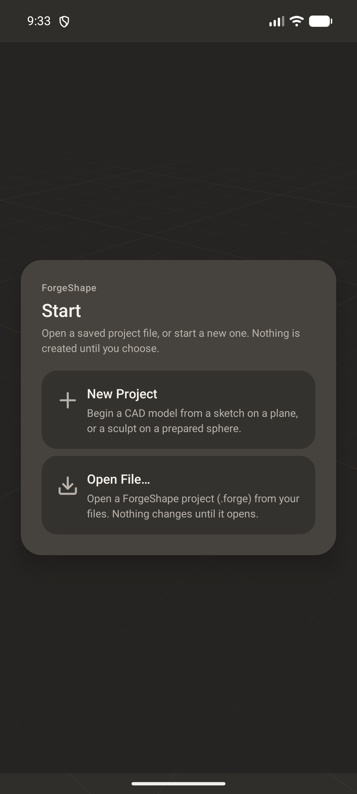
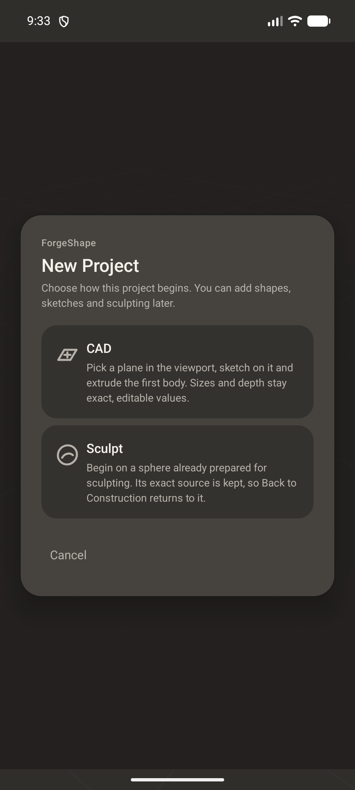
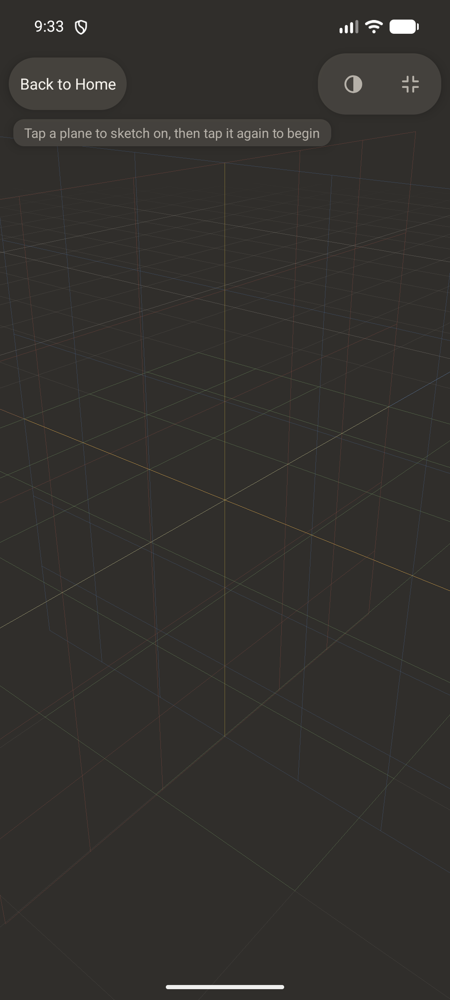
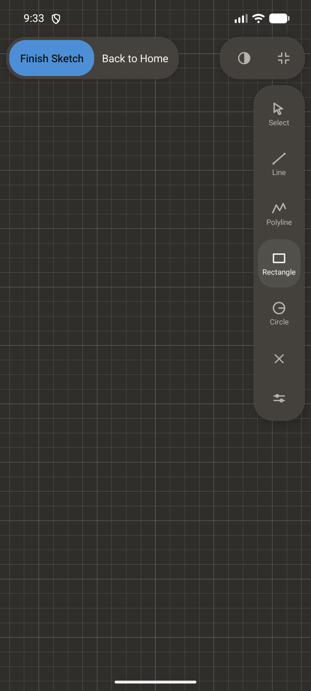
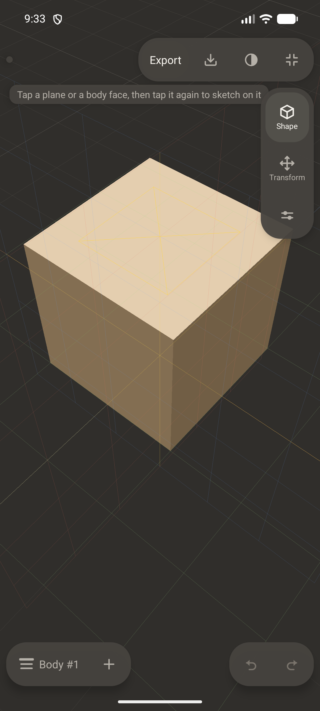
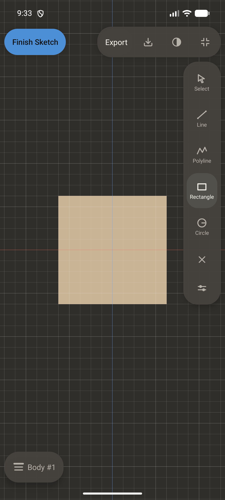
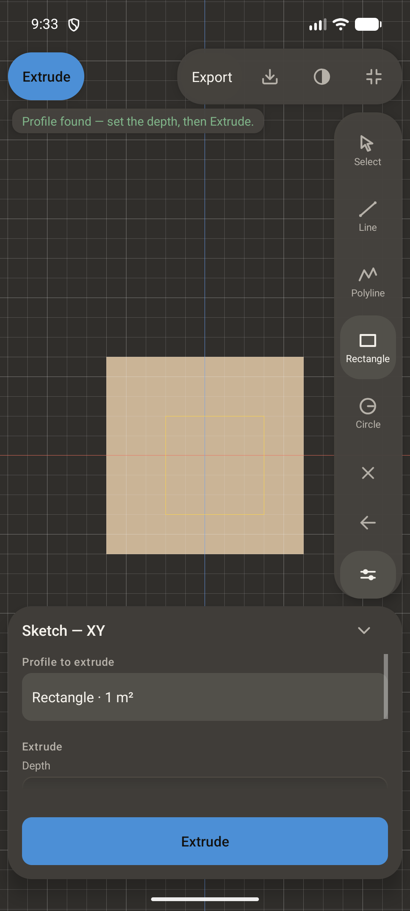
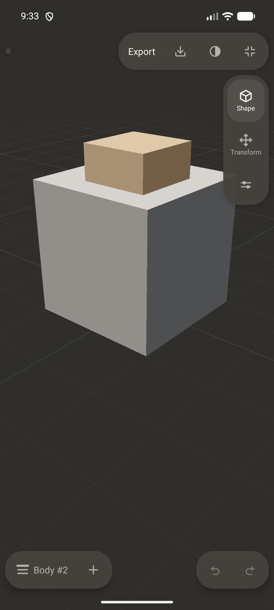

# Visual evidence - CAD-A3 + APP-H1 (`E2E-CADA3-VIS`)

Captured by CadA3VisualEvidenceTest on emulator-5580 (AVD ForgeShape_Stage006) through the composed display, one journey in ten frames. `OWNER_CONTACT_SHEET.png` is the ten frames at 300 px wide, five per row, in order; the full-resolution frames are in `frames/`.

Every line below is a fact the suite measured on the device at the moment of the capture: an element's presence and on-screen bounds in pixels, a selected or highlighted state, the camera projection mode (0 perspective, 1 orthographic), the support chooser's selected kind (-1 none, 0/1/2 the XY/XZ/YZ world plane, 3 a CAD face), the sketch state (0 inactive, 1 editing, 2 ready), the body count and the delete status (5 = refused, has dependents). Nothing aesthetic is asserted or claimed.

Captures: 10

## `01_home.png` (1080 x 2400)

- `home_visible` = `true`
- `project_open` = `false`
- `body_count` = `0`
- `home_new_project` = `[126,1120][954,1357] width_px=828 height_px=237`
- `home_open_file` = `[126,1378][954,1615] width_px=828 height_px=237`

## `02_new_project_chooser.png` (1080 x 2400)

- `new_project_chooser_visible` = `true`
- `new_project_cad` = `[126,988][954,1271] width_px=828 height_px=283`
- `new_project_sculpt` = `[126,1292][954,1575] width_px=828 height_px=283`
- `new_project_cancel` = `[126,1622][954,1748] width_px=828 height_px=126`

## `03_new_cad_world_planes.png` (1080 x 2400)

- `support_chooser_active` = `true`
- `project_open` = `false`
- `selected_kind` = `-1`
- `projection_mode` = `0`
- `back_to_home` = `[21,138][304,264] width_px=283 height_px=126`
- `plane_xy_target_px` = `(1060,813)`
- `plane_xz_target_px` = `(627,1690)`
- `plane_yz_target_px` = `(86,839)`

## `04_world_plane_highlighted.png` (1080 x 2400)

- `selected_kind` = `1`
- `selected_plane` = `XZ`
- `sketch_state` = `0`

## `05_orthographic_sketch_view.png` (1080 x 2400)

- `sketch_state` = `1`
- `projection_mode` = `1`
- `grid_step_m` = `0.25`
- `project_open` = `false`
- `finish_sketch` = `[32,139][327,264] width_px=295 height_px=125`
- `tool_rail_rectangle` = `[896,831][1043,999] width_px=147 height_px=168`

## `06_cad_face_highlighted.png` (1080 x 2400)

- `selected_kind` = `3`
- `selected_is_face` = `true`
- `producer_id` = `1`
- `body_count` = `1`

## `07_face_entering_sketch.png` (1080 x 2400)

- `sketch_state` = `1`
- `projection_mode` = `1`
- `support_chooser_active` = `false`

## `08_face_sketch_completed.png` (1080 x 2400)

- `sketch_state` = `2`
- `sketch_entities` = `1`
- `extrude_sketch` = `[21,138][222,264] width_px=201 height_px=126`

## `09_producer_and_dependent.png` (1080 x 2400)

- `body_count` = `2`
- `producer_id` = `1`
- `dependent_id` = `2`
- `dependent_face_supported` = `true`
- `delete_producer_status` = `5`
- `objects_capsule` = `[21,2168][442,2316] width_px=421 height_px=148`

## `10_reopened_dependency_restored.png` (1080 x 2400)

- `reopened_from_file` = `cad_a3_dependency.forge`
- `body_count` = `2`
- `dependent_face_supported` = `true`
- `delete_producer_status` = `5`
- `undo_depth` = `0`

Phone viewport only: the test harness has no separate tablet viewport (the layout suites simulate window sizes for the chrome, not a second display), so no tablet capture is claimed.
