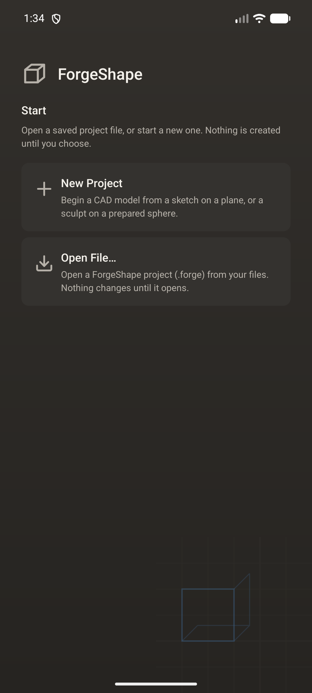
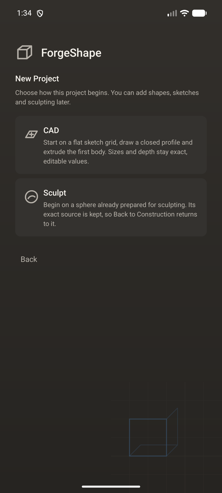
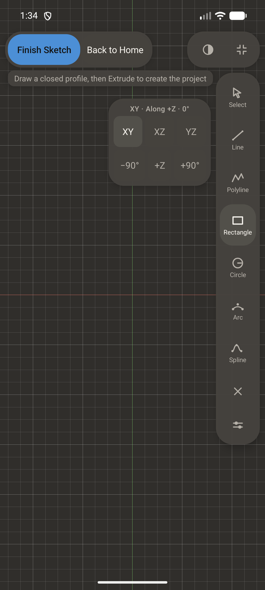
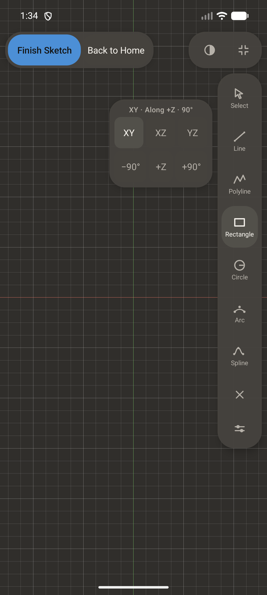
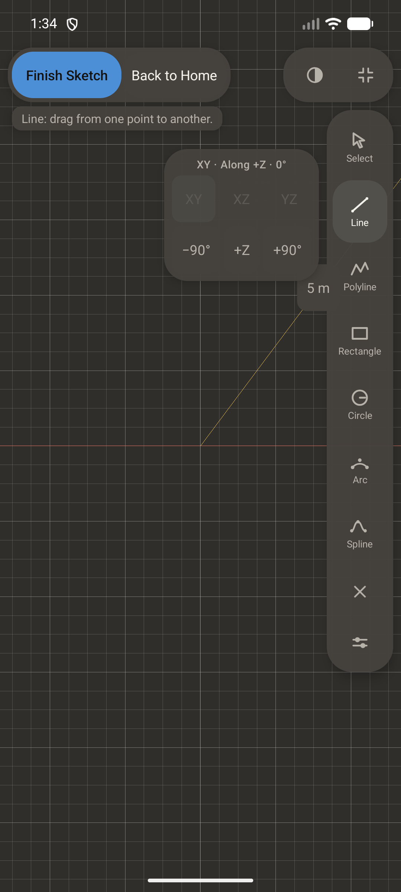
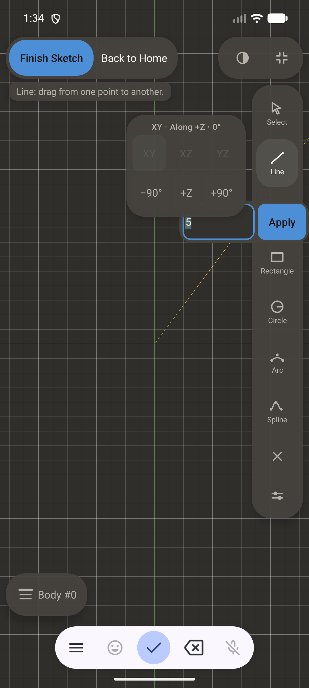
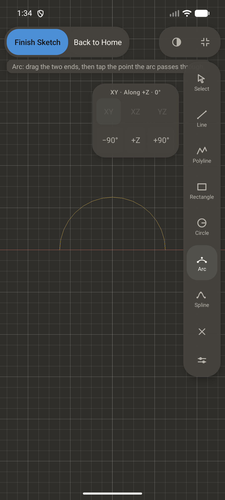
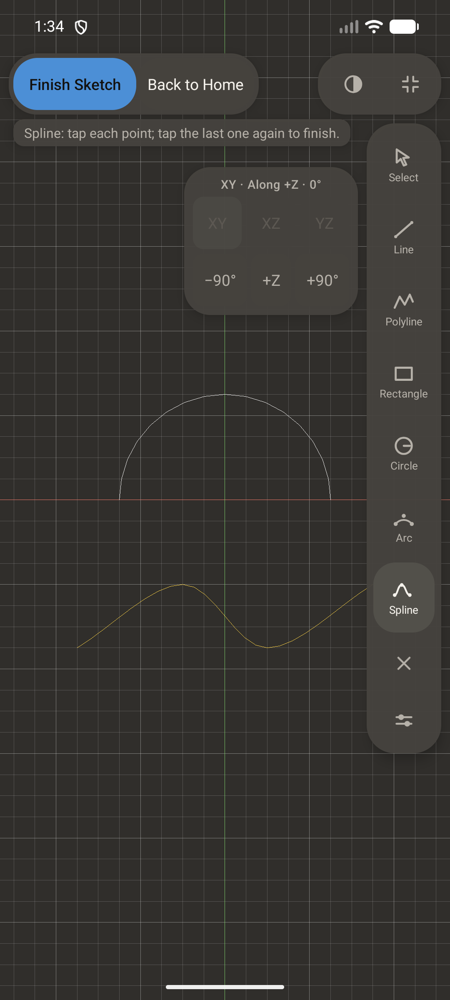
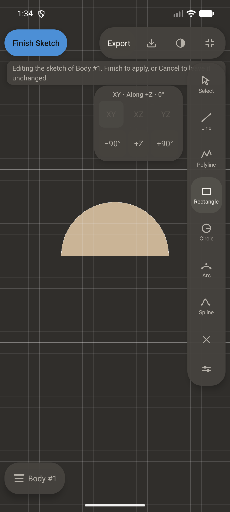
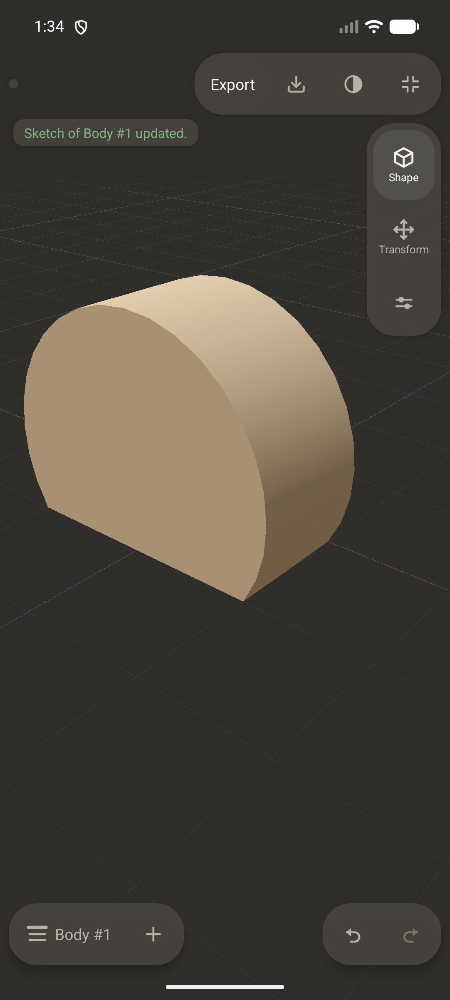

# Visual evidence - CAD-A3-C2 / SKETCH-UX-R1 (`E2E-CADUXR1-VIS`)

Captured by SketchUxVisualEvidenceTest on emulator-5580 (AVD ForgeShape_Stage006) through the composed display, one journey in twelve frames. `OWNER_CONTACT_SHEET_C2.png` is the twelve frames at 300 px wide, four per row, in order; the full-resolution frames are in `frames/`.

Every line below is a fact the suite measured on the device at the moment of the capture: an element's presence and on-screen bounds in pixels, a selected or highlighted state, the camera projection mode (0 perspective, 1 orthographic), the sketch state (0 inactive, 1 editing, 2 ready), the sketch plane (0 XY, 1 XZ, 2 YZ), the navigator's flip and quarter turns, an entity kind (0 line, 1 polyline, 2 rectangle, 3 circle, 4 arc, 5 spline), a length in metres, the body count and the history depth. **Nothing aesthetic is asserted, and no owner approval of how anything looks is claimed.**

Captures: 12

## `01_home_full_screen.png` (1080 x 2400)

- `home_visible` = `true`
- `home_is_full_window` = `true`
- `home_size_px` = `1080x2400`
- `window_size_px` = `1080x2400`
- `editor_toolbar_shown` = `false`
- `project_open` = `false`
- `body_count` = `0`
- `wordmark` = `[74,202][1006,307] width_px=932 height_px=105`
- `headline` = `[74,354][1006,407] width_px=932 height_px=53`
- `home_new_project` = `[74,564][1006,801] width_px=932 height_px=237`
- `home_open_file` = `[74,822][1006,1059] width_px=932 height_px=237`

## `02_new_project_page.png` (1080 x 2400)

- `new_project_is_full_window` = `true`
- `home_still_visible` = `false`
- `new_project_cad` = `[74,564][1006,847] width_px=932 height_px=283`
- `new_project_sculpt` = `[74,868][1006,1151] width_px=932 height_px=283`
- `new_project_back` = `[74,1198][1006,1324] width_px=932 height_px=126`

## `03_immediate_flat_sketch.png` (1080 x 2400)

- `support_chooser_active` = `false`
- `sketch_state` = `1`
- `project_open` = `false`
- `projection_mode` = `1`
- `grid_step_m` = `0.25`
- `tool_rail_arc` = `[896,1177][1043,1345] width_px=147 height_px=168`
- `tool_rail_spline` = `[896,1350][1043,1518] width_px=147 height_px=168`
- `finish_sketch` = `[32,139][327,264] width_px=295 height_px=125`

## `04_navigator_default_plus_z.png` (1080 x 2400)

- `view_plane` = `0`
- `view_flipped` = `0`
- `view_quarter_turns` = `0`
- `view_face_supported` = `0`
- `view_plane_switchable` = `1`
- `projection_mode` = `1`
- `navigator` = `[442,401][859,756] width_px=417 height_px=355`
- `navigator_label` = `[463,422][838,461] width_px=375 height_px=39`
- `navigator_flip` = `[603,609][698,735] width_px=95 height_px=126`
- `navigator_overlaps_tool_rail` = `false`

## `05_navigator_other_plane.png` (1080 x 2400)

- `view_plane` = `2`
- `view_flipped` = `0`
- `view_quarter_turns` = `0`
- `view_face_supported` = `0`
- `view_plane_switchable` = `1`
- `projection_mode` = `1`

## `06_navigator_rotated_plus_90.png` (1080 x 2400)

- `view_plane` = `0`
- `view_flipped` = `0`
- `view_quarter_turns` = `1`
- `view_face_supported` = `0`
- `view_plane_switchable` = `1`
- `projection_mode` = `1`

## `07_line_dimension.png` (1080 x 2400)

- `dimension_entity` = `1.0`
- `dimension_length_m` = `5.0`
- `dimension_label_text` = `5 m`
- `dimension_label` = `[800,711][914,837] width_px=114 height_px=126`

## `08_length_editor_open.png` (1080 x 2400)

- `dimension_editor_open` = `true`
- `dimension_editor` = `[627,700][1080,848] width_px=453 height_px=148`
- `dimension_field` = `[638,711][890,837] width_px=252 height_px=126`

## `09_arc_selected.png` (1080 x 2400)

- `length_after_typing_m` = `10.0`
- `entity_kind` = `4`
- `entity_is_arc` = `true`
- `sketch_entities` = `1`

## `10_spline_selected.png` (1080 x 2400)

- `entity_kind` = `5`
- `entity_is_spline` = `true`
- `sketch_entities` = `2`

## `11_edit_sketch_open.png` (1080 x 2400)

- `editing_body_id` = `1`
- `sketch_state` = `1`
- `sketch_entities` = `2`
- `undo_depth` = `0`
- `body_count` = `1`
- `navigator` = `[442,401][859,756] width_px=417 height_px=355`

## `12_edit_finished_regenerated.png` (1080 x 2400)

- `sketch_state` = `0`
- `body_count` = `1`
- `undo_depth_before_finish` = `0`
- `undo_depth_after_finish` = `1`
- `one_finish_is_one_undo` = `true`
- `body_is_cad` = `true`

Phone viewport only: the test harness has no separate tablet viewport (the layout suites simulate window sizes for the chrome, not a second display), so no tablet capture is claimed.
