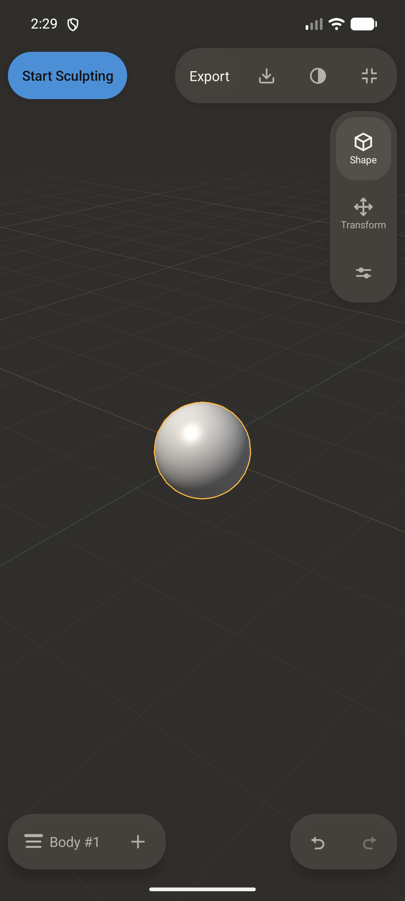
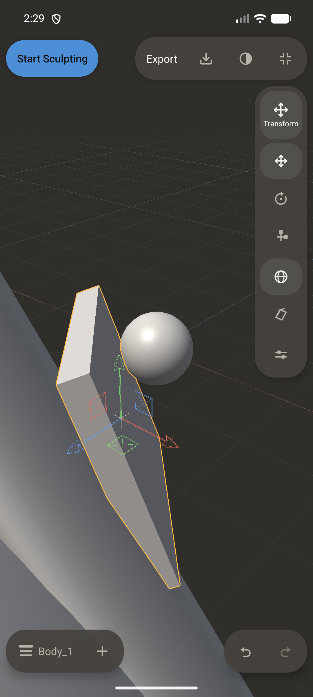
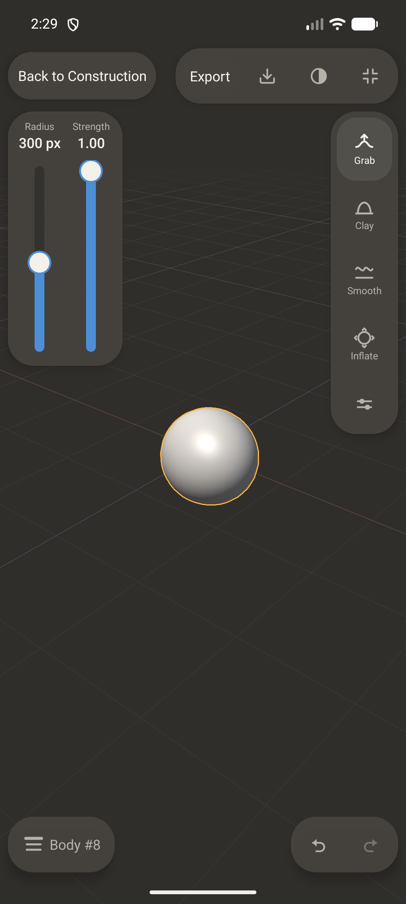
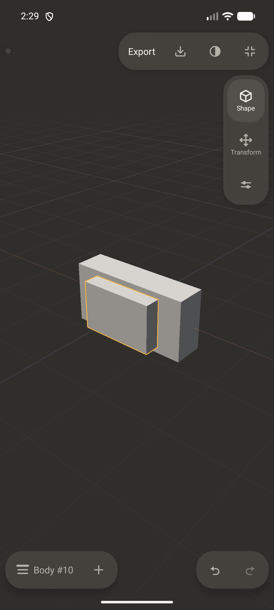
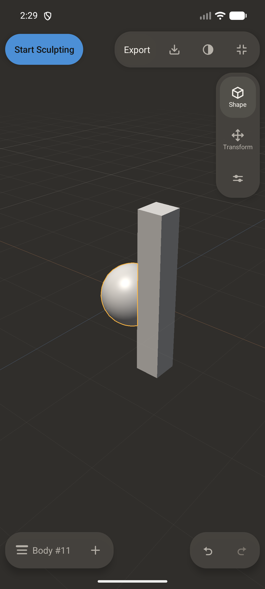
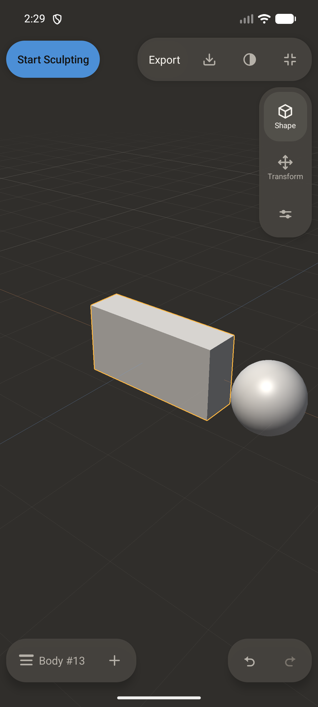
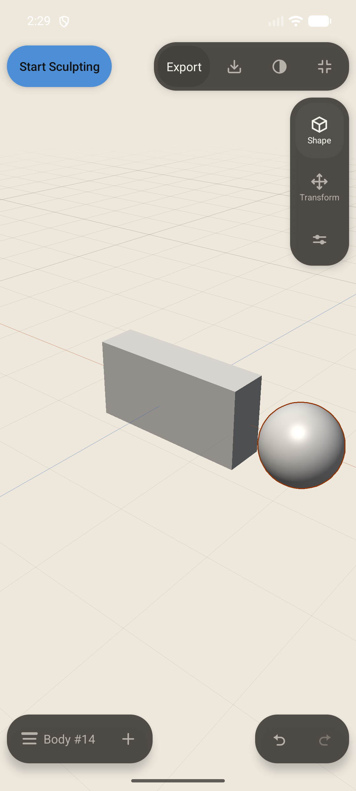
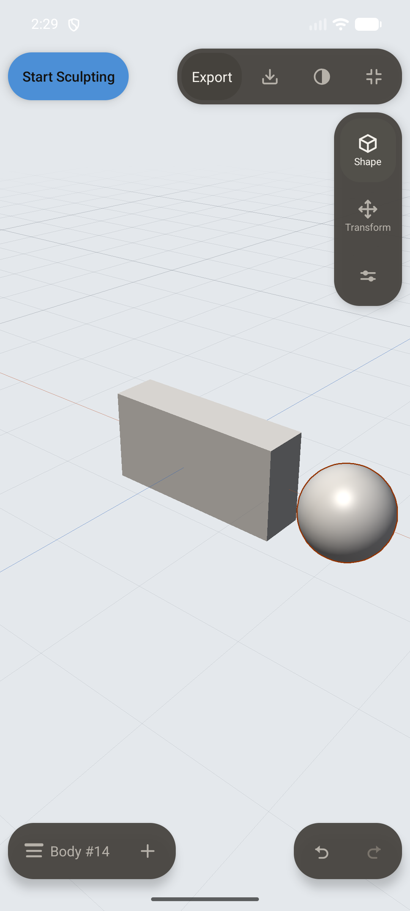
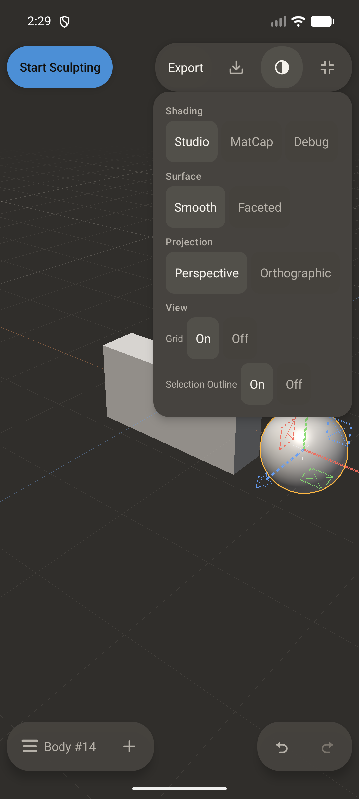
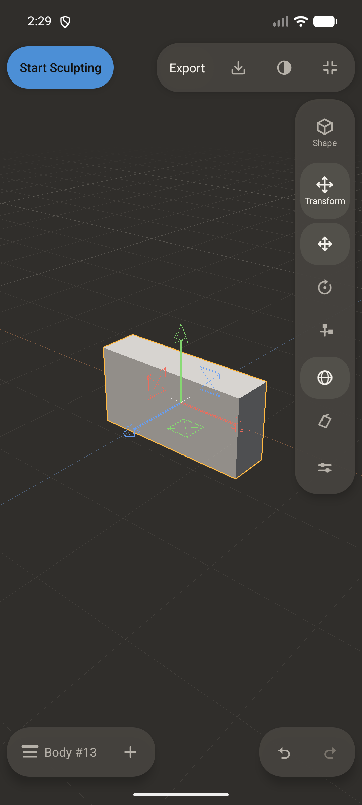

# Visual evidence - SEL-OUT-R1 (`E2E-SELOUTR1-VIS`)

Captured by SelectionOutlineVisualEvidenceTest on emulator-5580 (AVD ForgeShape_Stage006) through the composed display, one journey in twelve frames. `OWNER_CONTACT_SHEET_SEL_OUT_R1.png` is the twelve frames at 260 px wide, four per row, in order; the full-resolution frames are in `frames/`.

Every line below is a fact the suite measured on the device at the moment of the capture. Two kinds appear. The `renderer_*` values are what the Vulkan renderer reports about the resources it holds - the mask image's extent, how many times it has been allocated for the life of the process, the band's half-width in screen pixels and the number of composite draws recorded. The `measured_*` values are scanned out of the captured bitmap itself: the widest run of outline-coloured pixels along a horizontal cut through the middle of the display, how many such runs the cut crossed, and the ground colour sampled at the frame's edge. A frame with the outline OFF must find no runs at all, and that absence is the evidence for capture 02.

**Nothing aesthetic is asserted, and no owner approval of how anything looks is claimed.**

Captures: 12

## `01_construction_selected_dark.png` (1080 x 2400)

- `phase` = `construction_selected`
- `what` = `dark ground, outline on`
- `selected_object_id` = `1`
- `selected_representation` = `construction`
- `body_count` = `1`
- `outline_enabled` = `true`
- `grid_visible` = `true`
- `viewport_background_index` = `0`
- `product_mode` = `construction`
- `renderer_mask_extent_px` = `1080x2400`
- `renderer_mask_allocations` = `2`
- `renderer_band_half_width_px` = `3.02`
- `renderer_composite_draws` = `27`
- `measured_band_target_rgb` = `255,184,66`
- `measured_band_thickness_px_median_run` = `3`
- `measured_band_widest_run_px_tangent` = `45`
- `measured_band_run_count` = `257`
- `measured_band_matched_pixels` = `1144`
- `measured_band_bounding_box` = `x[410..669] y[1070..1328]`
- `measured_other_family_colour_pixels` = `0`
- `sampled_ground_rgb` = `48,46,43`

## `02_construction_outline_off.png` (1080 x 2400)

- `phase` = `construction_outline_off`
- `what` = `the same scene with the outline off`
- `selected_object_id` = `1`
- `selected_representation` = `construction`
- `body_count` = `1`
- `outline_enabled` = `false`
- `grid_visible` = `true`
- `viewport_background_index` = `0`
- `product_mode` = `construction`
- `renderer_mask_extent_px` = `1080x2400`
- `renderer_mask_allocations` = `2`
- `renderer_band_half_width_px` = `3.02`
- `renderer_composite_draws` = `371`
- `measured_band_target_rgb` = `255,184,66`
- `measured_band_thickness_px_median_run` = `0`
- `measured_band_widest_run_px_tangent` = `0`
- `measured_band_run_count` = `0`
- `measured_band_matched_pixels` = `0`
- `measured_band_bounding_box` = `none`
- `measured_other_family_colour_pixels` = `0`
- `sampled_ground_rgb` = `48,46,43`

## `03_imported_selected.png` (1080 x 2400)

- `phase` = `imported_selected`
- `what` = `a selected Imported Mesh`
- `selected_object_id` = `2`
- `selected_representation` = `imported_mesh`
- `body_count` = `7`
- `outline_enabled` = `true`
- `grid_visible` = `true`
- `viewport_background_index` = `0`
- `product_mode` = `construction`
- `renderer_mask_extent_px` = `1080x2400`
- `renderer_mask_allocations` = `2`
- `renderer_band_half_width_px` = `3.02`
- `renderer_composite_draws` = `427`
- `measured_band_target_rgb` = `255,184,66`
- `measured_band_thickness_px_median_run` = `3`
- `measured_band_widest_run_px_tangent` = `12`
- `measured_band_run_count` = `1048`
- `measured_band_matched_pixels` = `3291`
- `measured_band_bounding_box` = `x[192..622] y[982..2028]`
- `measured_other_family_colour_pixels` = `0`
- `sampled_ground_rgb` = `48,46,43`

## `04_sculpt_selected.png` (1080 x 2400)

- `phase` = `sculpt_selected`
- `what` = `a selected body in Sculpt, after a real stroke`
- `selected_object_id` = `8`
- `selected_representation` = `construction`
- `body_count` = `1`
- `outline_enabled` = `true`
- `grid_visible` = `true`
- `viewport_background_index` = `0`
- `product_mode` = `sculpt`
- `renderer_mask_extent_px` = `1080x2400`
- `renderer_mask_allocations` = `2`
- `renderer_band_half_width_px` = `3.02`
- `renderer_composite_draws` = `580`
- `measured_band_target_rgb` = `255,184,66`
- `measured_band_thickness_px_median_run` = `3`
- `measured_band_widest_run_px_tangent` = `43`
- `measured_band_run_count` = `258`
- `measured_band_matched_pixels` = `1147`
- `measured_band_bounding_box` = `x[426..688] y[1082..1340]`
- `measured_other_family_colour_pixels` = `0`
- `sampled_ground_rgb` = `47,45,42`

## `05_cad_selected.png` (1080 x 2400)

- `phase` = `cad_selected`
- `what` = `a selected CAD Body`
- `selected_object_id` = `10`
- `selected_representation` = `cad_body`
- `body_count` = `2`
- `outline_enabled` = `true`
- `grid_visible` = `true`
- `viewport_background_index` = `0`
- `product_mode` = `construction`
- `renderer_mask_extent_px` = `1080x2400`
- `renderer_mask_allocations` = `2`
- `renderer_band_half_width_px` = `3.02`
- `renderer_composite_draws` = `851`
- `measured_band_target_rgb` = `255,184,66`
- `measured_band_thickness_px_median_run` = `3`
- `measured_band_widest_run_px_tangent` = `12`
- `measured_band_run_count` = `310`
- `measured_band_matched_pixels` = `1399`
- `measured_band_bounding_box` = `x[334..625] y[1084..1396]`
- `measured_other_family_colour_pixels` = `0`
- `sampled_ground_rgb` = `48,46,43`

## `06_occluded_selected.png` (1080 x 2400)

- `camera_orbit_pose_yaw_pitch_distance` = `0.7,0.5,8.2`
- `occluder_placement` = `toward_eye 0.80, sideways 0.35, world (0.720, 0.384, 0.311)`
- `occluder_object_id` = `12`
- `occluded_selected_object_id` = `11`
- `phase` = `occluded_selected`
- `what` = `a slab stands between the camera and the SELECTED sphere`
- `selected_object_id` = `11`
- `selected_representation` = `construction`
- `body_count` = `2`
- `outline_enabled` = `true`
- `grid_visible` = `true`
- `viewport_background_index` = `0`
- `product_mode` = `construction`
- `renderer_mask_extent_px` = `1080x2400`
- `renderer_mask_allocations` = `2`
- `renderer_band_half_width_px` = `3.02`
- `renderer_composite_draws` = `1000`
- `measured_band_target_rgb` = `255,184,66`
- `measured_band_thickness_px_median_run` = `3`
- `measured_band_widest_run_px_tangent` = `43`
- `measured_band_run_count` = `257`
- `measured_band_matched_pixels` = `1010`
- `measured_band_bounding_box` = `x[410..562] y[1070..1328]`
- `measured_other_family_colour_pixels` = `0`
- `sampled_ground_rgb` = `48,46,43`

## `07_two_bodies_selection_a.png` (1080 x 2400)

- `body_a` = `13`
- `body_b` = `14`
- `phase` = `two_bodies_a_selected`
- `what` = `two bodies, A selected`
- `selected_object_id` = `13`
- `selected_representation` = `construction`
- `body_count` = `2`
- `outline_enabled` = `true`
- `grid_visible` = `true`
- `viewport_background_index` = `0`
- `product_mode` = `construction`
- `renderer_mask_extent_px` = `1080x2400`
- `renderer_mask_allocations` = `2`
- `renderer_band_half_width_px` = `3.02`
- `renderer_composite_draws` = `1137`
- `measured_band_target_rgb` = `255,184,66`
- `measured_band_thickness_px_median_run` = `3`
- `measured_band_widest_run_px_tangent` = `11`
- `measured_band_run_count` = `430`
- `measured_band_matched_pixels` = `2106`
- `measured_band_bounding_box` = `x[307..796] y[996..1428]`
- `measured_other_family_colour_pixels` = `0`
- `sampled_ground_rgb` = `48,46,43`

## `08_two_bodies_selection_b.png` (1080 x 2400)

- `phase` = `two_bodies_b_selected`
- `what` = `the same two bodies, B selected`
- `selected_object_id` = `14`
- `selected_representation` = `construction`
- `body_count` = `2`
- `outline_enabled` = `true`
- `grid_visible` = `true`
- `viewport_background_index` = `0`
- `product_mode` = `construction`
- `renderer_mask_extent_px` = `1080x2400`
- `renderer_mask_allocations` = `2`
- `renderer_band_half_width_px` = `3.02`
- `renderer_composite_draws` = `1235`
- `measured_band_target_rgb` = `255,184,66`
- `measured_band_thickness_px_median_run` = `3`
- `measured_band_widest_run_px_tangent` = `42`
- `measured_band_run_count` = `262`
- `measured_band_matched_pixels` = `1169`
- `measured_band_bounding_box` = `x[781..1047] y[1220..1482]`
- `measured_other_family_colour_pixels` = `0`
- `sampled_ground_rgb` = `48,46,43`

## `09_warm_light.png` (1080 x 2400)

- `phase` = `warm_light`
- `what` = `the outline over the Warm Light ground`
- `selected_object_id` = `14`
- `selected_representation` = `construction`
- `body_count` = `2`
- `outline_enabled` = `true`
- `grid_visible` = `true`
- `viewport_background_index` = `3`
- `product_mode` = `construction`
- `renderer_mask_extent_px` = `1080x2400`
- `renderer_mask_allocations` = `2`
- `renderer_band_half_width_px` = `3.02`
- `renderer_composite_draws` = `1337`
- `measured_band_target_rgb` = `148,51,0`
- `measured_band_thickness_px_median_run` = `3`
- `measured_band_widest_run_px_tangent` = `42`
- `measured_band_run_count` = `262`
- `measured_band_matched_pixels` = `1169`
- `measured_band_bounding_box` = `x[781..1047] y[1220..1482]`
- `measured_other_family_colour_pixels` = `0`
- `sampled_ground_rgb` = `237,231,220`

## `10_cool_light.png` (1080 x 2400)

- `phase` = `cool_light`
- `what` = `the outline over the Cool Light ground`
- `selected_object_id` = `14`
- `selected_representation` = `construction`
- `body_count` = `2`
- `outline_enabled` = `true`
- `grid_visible` = `true`
- `viewport_background_index` = `4`
- `product_mode` = `construction`
- `renderer_mask_extent_px` = `1080x2400`
- `renderer_mask_allocations` = `2`
- `renderer_band_half_width_px` = `3.02`
- `renderer_composite_draws` = `1432`
- `measured_band_target_rgb` = `148,51,0`
- `measured_band_thickness_px_median_run` = `3`
- `measured_band_widest_run_px_tangent` = `42`
- `measured_band_run_count` = `262`
- `measured_band_matched_pixels` = `1169`
- `measured_band_bounding_box` = `x[781..1047] y[1220..1482]`
- `measured_other_family_colour_pixels` = `0`
- `sampled_ground_rgb` = `228,232,236`

## `11_left_handed_view_overlay.png` (1080 x 2400)

- `handedness` = `LEFT`
- `workspace_reports_left_handed` = `true`
- `rail_zone_host_before_popover` = `[21,296][200,1473] width_px=179 height_px=1177`
- `tool_rail_before_popover` = `[37,312][184,653] width_px=147 height_px=341`
- `display_popover` = `[461,275][1059,1253] width_px=598 height_px=978`
- `selection_outline_on` = `[724,1090][821,1216] width_px=97 height_px=126`
- `selection_outline_off` = `[832,1090][935,1216] width_px=103 height_px=126`
- `rail_zone_host_while_popover_open` = `absent`
- `rail_zone_withdrawn_while_popover_open` = `true`
- `popover_overlaps_the_rail_zone` = `false`
- `phase` = `left_handed_overlay`
- `what` = `the View/Overlay surface, left-handed workspace`
- `selected_object_id` = `14`
- `selected_representation` = `construction`
- `body_count` = `2`
- `outline_enabled` = `true`
- `grid_visible` = `true`
- `viewport_background_index` = `0`
- `product_mode` = `construction`
- `renderer_mask_extent_px` = `1080x2400`
- `renderer_mask_allocations` = `2`
- `renderer_band_half_width_px` = `3.02`
- `renderer_composite_draws` = `1606`
- `measured_band_target_rgb` = `255,184,66`
- `measured_band_thickness_px_median_run` = `3`
- `measured_band_widest_run_px_tangent` = `36`
- `measured_band_run_count` = `220`
- `measured_band_matched_pixels` = `848`
- `measured_band_bounding_box` = `x[781..1047] y[1262..1482]`
- `measured_other_family_colour_pixels` = `0`
- `sampled_ground_rgb` = `48,46,43`

## `12_after_delete_fallback.png` (1080 x 2400)

- `deleted_object_id` = `14`
- `bodies_after_delete` = `1`
- `phase` = `after_delete_fallback`
- `what` = `the fallback selection after a Delete`
- `selected_object_id` = `13`
- `selected_representation` = `construction`
- `body_count` = `1`
- `outline_enabled` = `true`
- `grid_visible` = `true`
- `viewport_background_index` = `0`
- `product_mode` = `construction`
- `renderer_mask_extent_px` = `1080x2400`
- `renderer_mask_allocations` = `2`
- `renderer_band_half_width_px` = `3.02`
- `renderer_composite_draws` = `1766`
- `measured_band_target_rgb` = `255,184,66`
- `measured_band_thickness_px_median_run` = `3`
- `measured_band_widest_run_px_tangent` = `11`
- `measured_band_run_count` = `435`
- `measured_band_matched_pixels` = `2094`
- `measured_band_bounding_box` = `x[307..796] y[996..1428]`
- `measured_other_family_colour_pixels` = `0`
- `sampled_ground_rgb` = `48,46,43`

Phone viewport only: the test harness has no separate tablet viewport, so no physical tablet capture is claimed.
