# Stage 015C — Viewport shading comparison sheet

Runtime evidence from `emulator-5558` (`ForgeShape_Stage006`, pixel_6, 1080×2400,
API 36), captured through the real Android touch path. Every control was reached
by its stable semantic id; no coordinate in this run was written down in advance.

Read the pairs, not the individual frames — each one isolates a single claim.

## The default appearance changed

| | |
| --- | --- |
| 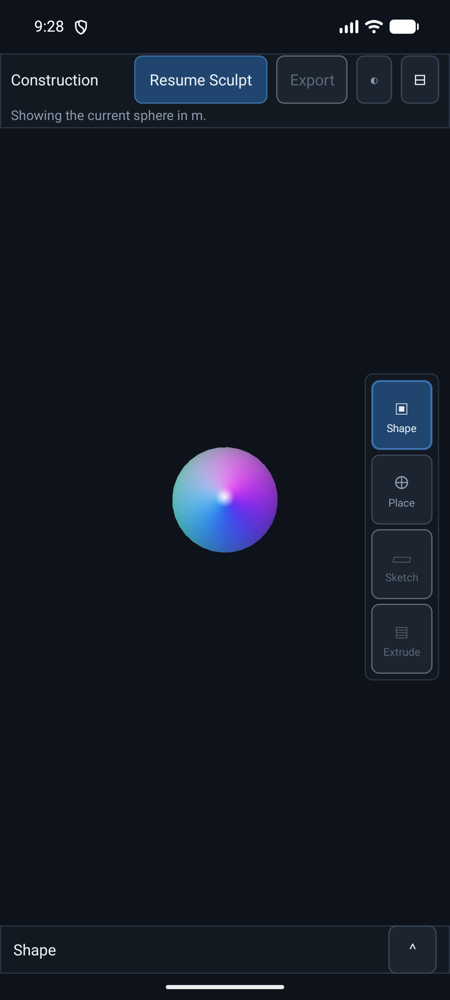 | 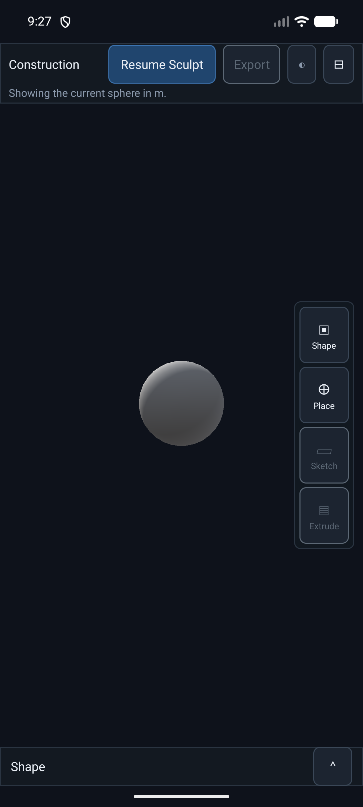 |
| **Debug source colour** — the per-vertex rainbow the viewport drew before this stage. Still reachable in a debuggable build, never the default. | **Studio Solid, Smooth** — the new default. Neutral clay, camera-relative key from the upper left, restrained specular. |

## Hard and smooth boundaries on one object

| | |
| --- | --- |
| 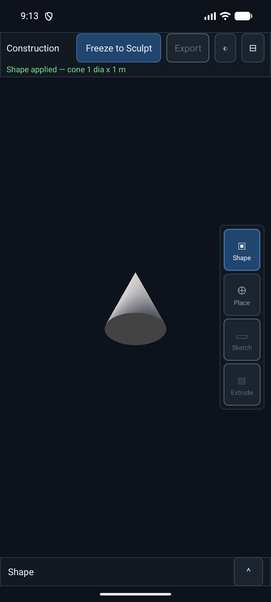 | 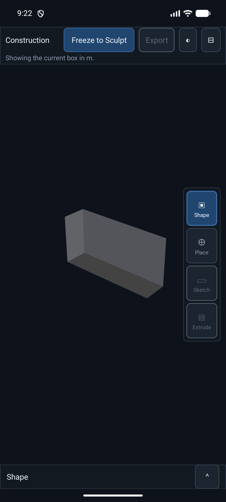 |
| **Cone** — the whole contract in one frame: a smooth lateral surface, a flat base, a hard rim between them, and a clean apex with no black spike. `src=34:192 → render=66:192`. | **Box** — six planar faces, hard 90° edges, no rounded corners, and three clearly separated face values. `src=8:36 → render=24:36`. |

## Studio Solid against MatCap

| | |
| --- | --- |
|  | 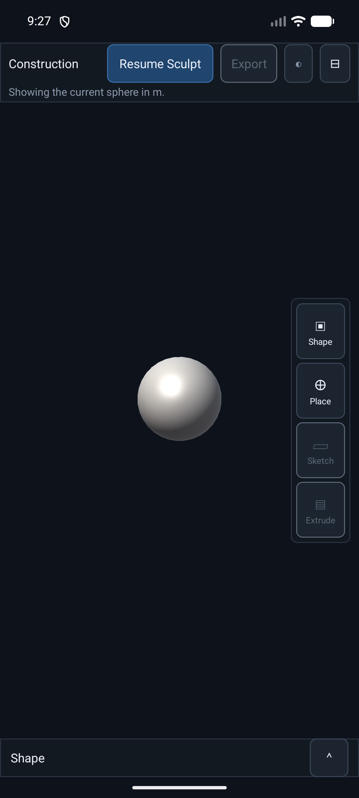 |
| **Studio Solid** — matte and even, tuned for judging planar faces and exact silhouettes. | **MatCap** — glossier and higher-contrast, tuned for reading curvature. Same geometry, same light direction; switching between them rebuilds nothing. |

## Smooth against Faceted

| | |
| --- | --- |
|  | 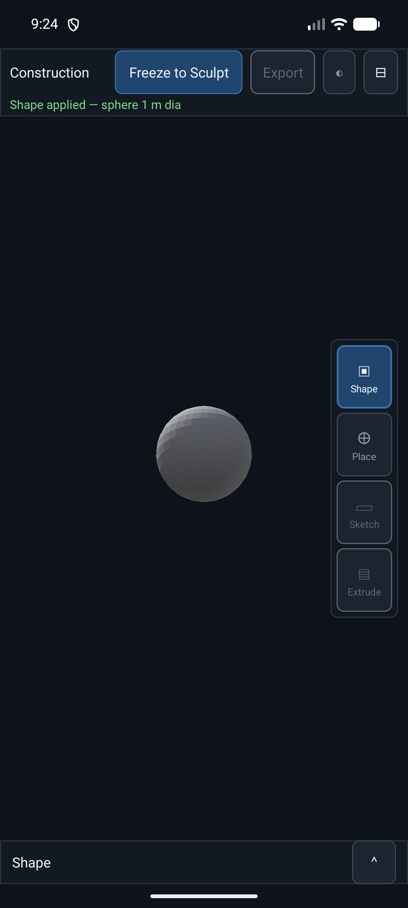 |
| **Smooth** — `render=482:2880`, identical to the source topology, because a closed smooth surface has no crease to split on. | **Faceted** — `render=2880:2880`, one flat normal per triangle. Deliberately exposes triangle structure. Same source revision, same triangles. |

## Sculpt deformation relights as it happens

| | |
| --- | --- |
| 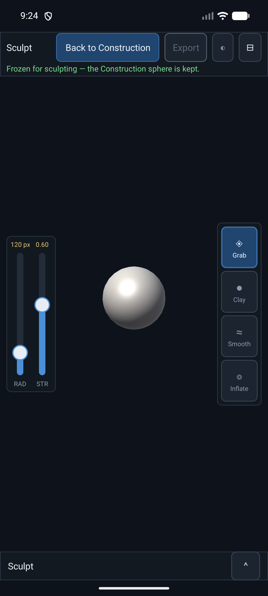 | 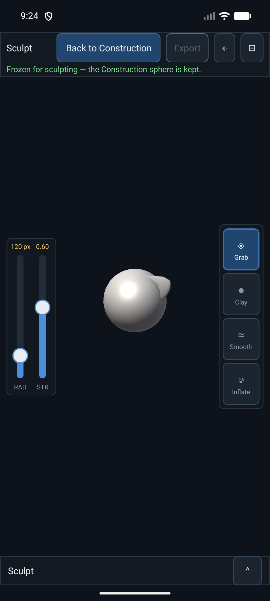 |
| **Frozen Sculpt Mesh**, before the stroke. | **After a real 5-move Grab stroke.** The pulled lobe carries its own shading and a visible crease where it meets the sphere — no stale lighting anywhere. Render count moved 482 → 492 as the deformation created genuine creases; every upload was `reuse`. |

## Selection, and the rotated display

| | |
| --- | --- |
| 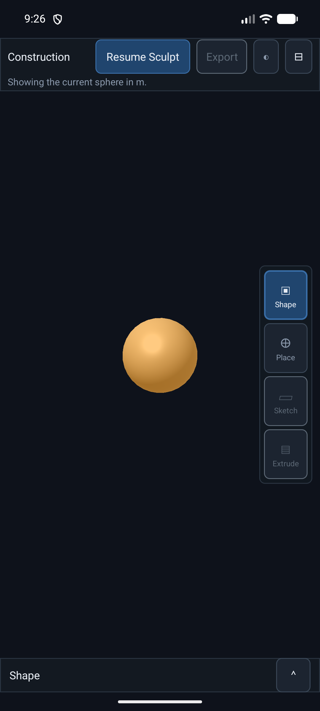 | 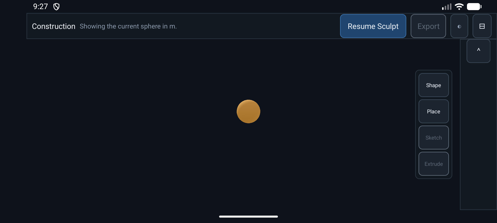 |
| **Selection in MatCap** — the tint is unmistakable and the form gradient survives it, because the tint mixes *after* shading rather than replacing the albedo. | **Rotated landscape** — Studio Solid is equally readable, the sphere stays circular, and `viewport_surface` is still full-bleed at `[0,0][2400,1080]` with an identity pre-transform. |

## The control

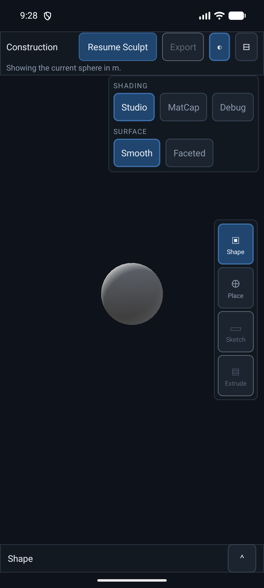

Two labelled groups in the Global Toolbar's display popover: Shading (Studio /
MatCap / Debug) and Surface (Smooth / Faceted). The Debug chip exists only in a
debuggable build. Every chip has a stable semantic id.
